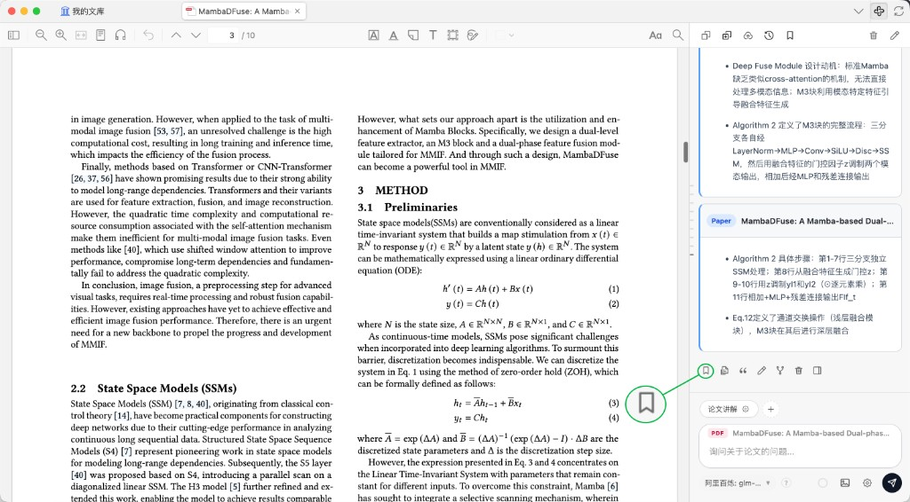
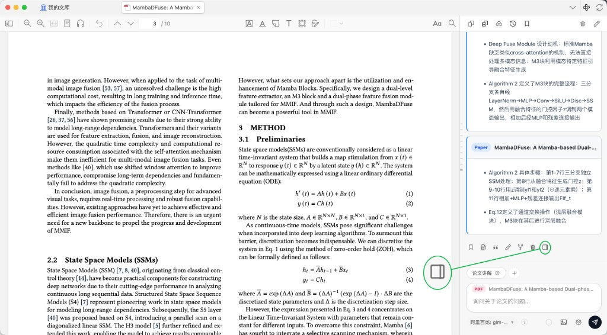
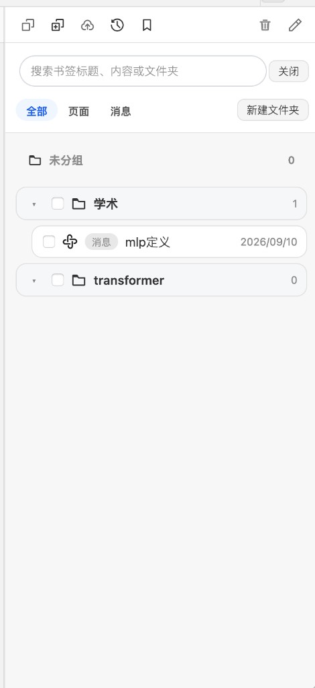
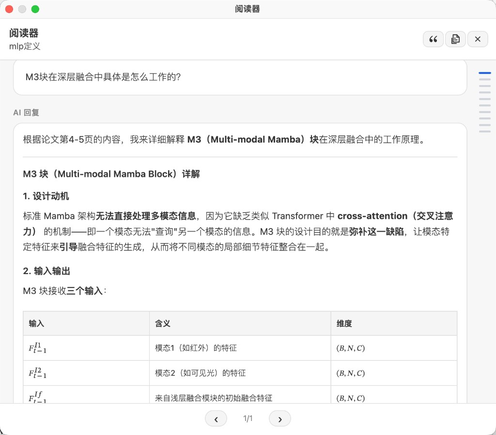
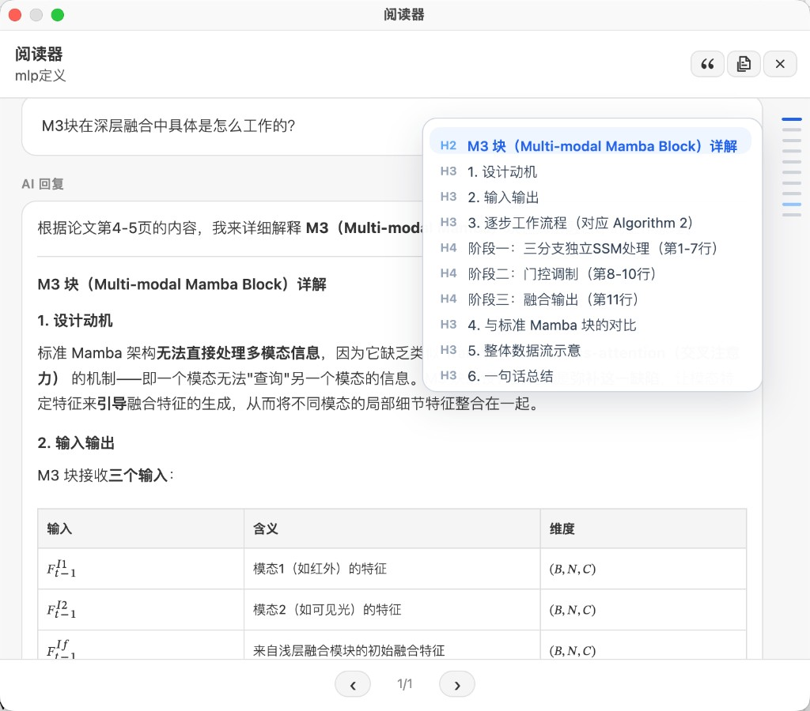

# PaperMind: 你的 Zotero 阅读器 AI 助手

[](https://www.zotero.org)
[](https://github.com/windingwind/zotero-plugin-template)
[](https://www.gnu.org/licenses/agpl-3.0)
[](https://github.com/xutaoya/paper-mind/releases)
[](https://github.com/syt2/paper-chat-for-zotero)

<p align="center">
  
</p>

**PaperMind**（论文智读）是基于 [syt2/paper-chat-for-zotero](https://github.com/syt2/paper-chat-for-zotero) 的个人二创 fork。它将大语言模型直接集成进 [Zotero](https://www.zotero.org/) PDF 阅读器——不用把论文上传到网页，在阅读器侧边栏就能提问、总结、框选图表讨论。插件 ID 与上游不同，可与原版并存安装。

已上架 [Zotero 中文社区](https://zotero-chinese.com) [插件商店](https://zotero-chinese.com/plugins/)，可从国内镜像下载安装。

## 截图

<table>
  <tr>
    <td align="center" width="50%">
      <br />
      阅读器分屏对话
    </td>
    <td align="center" width="50%">
      <br />
      对话面板与快捷操作
    </td>
  </tr>
  <tr>
    <td align="center">
      <br />
      框选图表截图提问
    </td>
    <td align="center">
      <br />
      背景信息窗口
    </td>
  </tr>
</table>

### 书签

<table>
  <tr>
    <td align="center" width="50%">
      <br />
      从对话消息保存书签
    </td>
    <td align="center" width="50%">
      <br />
      从阅读器保存书签
    </td>
  </tr>
  <tr>
    <td align="center" width="50%">
      <br />
      书签管理与搜索
    </td>
    <td align="center" width="50%">
      <br />
      阅读器查看书签
    </td>
  </tr>
  <tr>
    <td align="center" colspan="2">
      <br />
      书签章节导航
    </td>
  </tr>
</table>

---

## 目录

- [安装](#安装)
- [配置](#配置)
- [使用](#使用)
- [功能概览](#功能概览)
- [本地开发](#本地开发)
- [许可证与致谢](#许可证与致谢)

---

## 安装

### 方式一：Zotero 中文社区（推荐）

1. 打开 [Zotero 中文社区插件商店](https://zotero-chinese.com/plugins/)
2. 搜索 **PaperMind**（论文智读），下载 `.xpi`
3. Zotero → `工具` → `附加组件` → ⚙️ → **从文件安装附加组件** → 选择 `.xpi`
4. 重启 Zotero

### 方式二：GitHub Releases

从 [Releases](https://github.com/xutaoya/paper-mind/releases) 下载最新 `.xpi`，按上述步骤 3–4 安装。

重启后插件会在启动时自动检查更新（生产构建）。

---

## 配置

打开 `设置` → **PaperMind**：

1. 选择 **服务商**（OpenAI、Claude、Gemini、DeepSeek、阿里百炼等）
2. 填写 **API Key** 和 **接口地址**，选择 **模型**
3. 点击 **测试连接** 验证

<table>
  <tr>
    <td align="center" width="50%">
      <br />
      服务商配置
    </td>
    <td align="center" width="50%">
      <br />
      MinerU 解析
    </td>
  </tr>
</table>

---

## 使用

1. 在 Zotero 中打开任意 PDF
2. 点击阅读器右侧工具栏的聊天图标，打开侧边栏
3. 输入问题，例如「这篇论文的核心贡献是什么？」
4. 需要全文上下文时勾选 **附加 PDF**；输入框上方会显示当前附加上下文（论文、截图等）
5. 点击输入框旁的 **背景信息窗口** 图标，查看 token 占用（已用 / 总量 / 剩余百分比）
6. 框选图表区域可 **截图提问**，截图自动带入对话
7. 底部快捷按钮可一键触发常用 prompt（论文讲解、文献标注、标签生成等）
8. 点击消息或阅读器中的 **书签** 图标，保存重要问答；在书签面板中搜索、分文件夹管理，并用阅读器回看

---

## 功能概览

| 功能 | 说明 |
| --- | --- |
| 阅读器内对话 | 打开 PDF 即聊，支持附加全文上下文 |
| 上下文管理 | 输入框上方展示附加上下文；背景信息窗口显示 token 占用 |
| 截图提问 | 框选图表区域，截图自动带入对话 |
| 多服务商 | 自备 API Key，支持自定义接口 |
| 快捷操作 | 论文讲解、文献标注、标签生成等一键 prompt |
| MinerU 解析 | 文本提取失败时自动/手动解析 PDF |
| 会话管理 | 多会话历史、轮次导航、删除单轮对话 |
| 书签 | 保存对话/阅读器内容，文件夹管理、搜索、阅读器回看与章节导航 |
| Markdown / 公式 | 流式输出，笔记导出支持 LaTeX |

**本 fork 额外改动：** 输出截断自动续写、笔记 LaTeX 公式、模型 API 测速；移除了阅读循环等用不上的功能。

**未跟进上游：** 演示文稿生成、内置 PaperChat 服务——需要请用 [上游原版](https://github.com/syt2/paper-chat-for-zotero)。

---

## 本地开发

```bash
npm install
npm run build    # 产物在 build/
npm start        # 开发调试
```

发布新版本：

```bash
npm run release
```

会创建 GitHub Release（标签 `V版本号`），并更新 `release` 标签下的 `update.json`。

---

## 许可证与致谢

[AGPL-3.0](LICENSE)（继承自上游项目）

- 原作者：[syt2/paper-chat-for-zotero](https://github.com/syt2/paper-chat-for-zotero)
- 插件模板：[zotero-plugin-template](https://github.com/windingwind/zotero-plugin-template)
- 分发渠道：[Zotero 中文社区](https://zotero-chinese.com)
